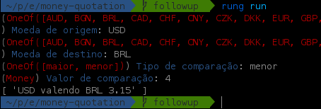
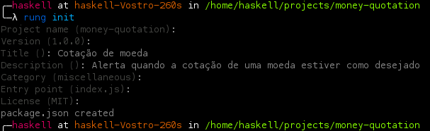

# Escrevendo sua primeira extensão para o Rung

Nesse documento, estaremos cobrindo os passos para desenvolvimento de uma
extensão capaz de obter a cotação de uma moeda, especificada pelo usuário,
convertida para outra moeda, também parametrizada. Estaremos usando uma API
de terceiros para obter os valores. Vamos nomear nossa extensão como
`money-quotation`. O objetivo será gerar alertas para quando a primeira moeda
estiver valendo **mais** ou **menos** que o valor que especificarmos.



## Como funcionam as extensões

O Rung suporta o desenvolvimento de extensões usando JavaScript, mais
especificamente, EcmaScript 5 e tudo que for suportado pelo NodeJS 6.*.
As extensões rodam dentro do Rung em um contexto seguro de máquina virtual (V8)
e os resultados de saída, que podem ser de retorno ou através de chamadas de
funções, são passados para a inteligência do Rung para a geração de alertas.

## O que eu preciso saber?

É ideal que já se possua conhecimento básico de JavaScript e o sistema de
pacotes `npm`, já que o Rung funciona de maneira bem similar. As extensões podem
ser desenvolvidas em qualquer sistema operacional NT ou POSIX-compliant.

## Instalando as dependências

Pressupondo que o programador já possui o NodeJS 6.* instalado em sua máquina,
iremos precisar, primordialmente, instalar globalmente um pacote do `npm`: o
`rung-cli`:

`npm install -g rung-cli`

Com isso, você terá disponível o comando `rung`. Você pode ver
[aqui](https://github.com/rung-tools/rung-cli#commands) a lista de subcomandos
que são suportados pela ferramenta

## Iniciando o projeto

Crie uma pasta para o seu projeto e abra o terminal. De agora em diante,
trabalharemos muito com ele! Aceda à sua pasta e vamos criar um projeto vazio:

`rung init`



Preenchemos as informações básicas. Isso irá apenas criar um `package.json`
compatível com o utilizado pelo `npm`. O Rung utiliza o mesmo arquivo.

A estrutura do arquivo `package.json` gerado será a seguinte:

```json
{
  "name": "money-quotation",
  "version": "1.0.0",
  "description": "Alerta quando a cotação de uma moeda estiver como desejado",
  "license": "MIT",
  "main": "index.js",
  "category": "miscellaneous",
  "rung": {
    "title": "Cotação de moeda"
  }
```

Inicialmente, vamos mostrar ao usuário como nosso alerta parecerá, adicionando
um campo `preview` dentro de `rung`:

```diff
    "rung": {
        "title": "Cotação de moeda",
+       "preview": "USD valendo BRL 3.13"
    }
}
```

Também precisamos adicionar como dependência o `rung-sdk`, que utilizaremos
como a base para a construção da extensão, mas localmente, via `npm` dessa vez:

`npm install --save rung-sdk`

Com isso, será automaticamente adicionado às `dependencies`:

```diff
    license: "MIT",
+   "dependencies": {
+       "rung-sdk": "^1.0.6"
+   }
}
```

Também é aconselhável, agora, a instalação de alguns pacotes que serão úteis no
nosso desenvolvimento:

| Pacote               | Função                                |
|----------------------|---------------------------------------|
| `bluebird`           | Promises para computações assíncronas |
| `ramda`              | Funções para listas                   |
| `superagent`         | Requisição HTTP(S)                    |
| `superagent-promise` | Promises com o `superagent`           |

Logo, execute `npm install --save bluebird ramda superagent superagent-promise`.

Com tudo configurado, podemos finalmente iniciar o desenvolvimento. Crie um
arquivo `index.js` dentro da pasta do projeto, como especificou como ponto de
entrada no `package.json`.

Abaixo segue o código-fonte com as explicações comentadas:

```javascript
// Função padrão para criação de extensão
const { create } = require('rung-sdk');
// O SDK conta com uma gama de tipos para os parâmetros
const { OneOf, Money } = require('rung-sdk/dist/types');
// Pacotes utilitários
const Bluebird = require('bluebird');
const agent = require('superagent');
const promisifyAgent = require('superagent-promise');
const { path, lt, gt } = require('ramda');

const request = promisifyAgent(agent, Bluebird);

// Ponto de entrada. A função principal recebe um contexto (que contém os
// parâmetros) e, opcionalmente, uma função `done`. Se `done` não for definida,
// os alertas devem ser **retornados**. Caso contrário, os alertas devem ser
// parâmetros de `done(...)`
function main(context, done) {
    // Obter os parâmetros do contexto
    const { origin, target, comparator, value } = context.params;
    const compare = comparator === 'maior' ? gt : lt;

    // Não gere alertas quando a moeda for a mesma
    if (origin === target) {
        return done({});
    }

    // Consultar a API do fixer.io, obter a cotação para moeda alvo
    // e comparar com a origem, gerando um único alerta caso a comparação seja
    // positiva ou não gerando alertas
    return request.get(`http://api.fixer.io/latest?base=${origin}`)
        .then(path(['body', 'rates', target]))
        .then(result => compare(result, value)
            ? [`${origin} valendo ${target} ${result.toFixed(2)}`]
            : {})
        // Invoque a função de callback para dizer que está terminado, já que
        // essa é uma extensão assíncrona
        .then(done)
        .catch(() => done({}));
}

// Tipos de moedas que aceitaremos
const currencies = [
    'AUD', 'BGN', 'BRL', 'CAD', 'CHF', 'CNY', 'CZK', 'DKK', 'EUR',
    'GBP', 'HKD', 'HRK', 'HUF', 'IDR', 'ILS', 'INR', 'JPY', 'KRW',
    'MXN', 'MYR', 'NOK', 'NZD', 'PHP', 'PLN', 'RON', 'RUB', 'SEK',
    'SGD', 'THB', 'TRY', 'USD', 'ZAR'
];

// Definição dos parâmetros de entrada
const params = {
    origin: {
        description: 'Moeda de origem',
        type: OneOf(currencies),
        default: 'USD'
    },
    target: {
        description: 'Moeda de destino',
        type: OneOf(currencies),
        default: 'BRL'
    },
    comparator: {
        description: 'Tipo de comparação',
        type: OneOf(['maior', 'menor']),
        default: 'menor'
    },
    value: {
        description: 'Valor de comparação',
        type: Money,
        default: 3.0
    }
};

// Criar a aplicação, onde o primeiro parâmetro é a função principal e o segundo
// é a configuração da aplicação
const app = create(main, { params });

// Deixar o conteúdo acessível pela máquina virtual do Rung
module.exports = app;
```

Com isso, já é possível rodarmos nossa extensão. Teste com os parâmetros, em
sequência, `USD`, `BRL`, `menor`, `4`. Caso o dólar esteja valendo menos que
R$ 4,00, um alerta será retornado

# Compilando o pacote

Para compilar e gerar o binário `*.rung`, utilize o comando `rung build`. O
arquivo gerado pode ser subido como uma extensão privada no Rung ou publicado
para a loja caso haja _karma_. Se você possuir _karma_ de publicação,
`rung publish` irá subir sua extensão diretamente para a loja.

## Extras

Outras features são suportadas no desenvolvimento de extensões do Rung:

### Chaves primárias

Você pode retornar `['Alerta 1', 'Alerta 2']` para a geração ou pode usar
chaves ao invés disso, caso queria modificar um alerta na próxima vez que a
extensão rodar no Rung (ao invés de recriar). É possível utilizar:

```javascript
{
    alerta_1: 'Alerta 1',
    alerta_2: 'Alerta 2'
}
```

Para habilitar, basta utilizar a flag `{ primaryKey: true }` no objeto de
configurações, o mesmo que contém os parâmetros.

### Rung Bot

Contamos com o Rung Bot, um robozinho responsável por auxiliar o usuário nos
alertas. Ele pode dar informações importantes detalhando um alerta, e suporta
Markdown!


Ao invés de usar uma _string_ como valor, você pode usar um objeto contendo
`title` e `comment`, tal qual:

```javascript
{
    alerta_1: {
        title: 'Alerta 1',
        comment: 'Estou aqui para te **ajudar**!'
    }
}
```

### Itens da barra lateral

Os campos da barra lateral do Rung também são programáveis!


Utilizamos a flag `sidebar` no objeto de configurações. Por padrão, todos os
campos são habilitados. Se quiser desabilitar algum, pode passar
`nomeDoCampo: false`. Exemplo:

```javascript
{
    params: {},
    sidebar: {
        percent: false,
        priority: false
    }
}
```

Os campos aceitos são `title`, `percent`, `priority`, `situation`, `startDate` e
`endDate`.
