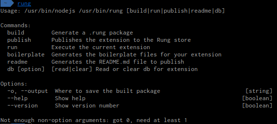
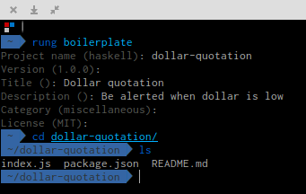

# Escrevendo sua primeira extensão para o Rung

Nesse documento, estaremos cobrindo os passos para desenvolvimento de uma
extensão capaz de obter a cotação do dólar e avisar quando ele estiver abaixo
do valor informado. Estaremos usando uma API de um terceiro para obter os valores. 
Vamos nomear nossa extensão como `dollar-quotation`. O objetivo será gerar 
alertas para quando a primeira moeda estiver valendo **menos** que o valor que especificarmos.


## Como funcionam as extensões

O Rung suporta o desenvolvimento de extensões usando JavaScript, mais
especificamente, EcmaScript 6 e tudo que for suportado pelo NodeJS 6.*.
As extensões rodam dentro do Rung em um contexto seguro de máquina virtual (V8)
e os resultados de saída, que podem ser de retorno ou através de chamadas de
funções, são passados para a inteligência do Rung para a geração de alertas.
Nós escrevemos uma ferramenta que permite a você testar a execução de sua extensão
sem ter que conhecer diretamente o funcionamento do Rung.

## O que eu preciso saber?

É ideal que já se possua conhecimento básico de JavaScript e o sistema de
pacotes `npm`, já que o Rung funciona de maneira bem similar. As extensões podem
ser desenvolvidas em qualquer sistema operacional NT ou POSIX-compliant (Windows, Linux, OS X, Solaris, BSD).

## Instalando as dependências

Pressupondo que o programador já possui o NodeJS 6.* instalado em sua máquina,
iremos precisar, primordialmente, instalar globalmente um pacote do `npm`: o
`rung-cli`:

`npm install -g rung-cli`

Se receber um erro dizendo que no há o comando `npm`, busque instalar o NodeJS no [site
oficial da plataforma](https://nodejs.org/en/download/).

Com isso, você terá disponível o comando `rung`. Você pode ver
[aqui](https://github.com/rung-tools/rung-cli#commands) a lista de subcomandos
que são suportados pela ferramenta



## Iniciando o projeto

Execute o comando em seu terminal:

`rung boilerplate`

Informe `dollar-quotation` como nome do projeto. Dê também um título e uma descrição,
preferencialmente em inglês, pois trataremos de internacionalizar o projeto depois!



Após isso, teremos uma pasta criada chamada `dollar-quotation` contendo o arquivo
de manifesto com as informações básicas da nossa extensão e um arquivo `index.js`,
que é onde trabalharemos!

### Dependências do projeto

Nosso projeto também possuirá algumas dependências. Utilizaremos algumas bibliotecas
de terceiros para fazer coisas como requisição para a API, manipulação das estruturas
e outras coisas. Instalaremos os seguintes pacotes:

| Pacote               | Função                                |
|----------------------|---------------------------------------|
| `bluebird`           | Promises para computações assíncronas |
| `ramda`              | Funções para listas                   |
| `superagent`         | Requisição HTTP(S)                    |
| `superagent-promise` | Promises com o `superagent`           |
| `rung-sdk`           | Para poder "montar" uma extensão      |
| `rung-cli`           | Para trabalhar com os "tipos"         |

Logo, execute `npm install --save bluebird ramda superagent superagent-promise rung-sdk rung-cli` dentro
da pasta `dollar-quotation`

### Começando a programar

Com tudo isso já configurado, podemos começar a desenvolver. Inicialmente, teremos o
seguinte fonte, que tem partes do nosso código e partes do código gerado:

```js
import { create } from 'rung-sdk';
import { String as Text } from 'rung-cli/dist/types';

function render(name) {
    return <b>{ _('Hello {{name}}', { name }) }</b>;
}

function main(context) {
    const { name } = context.params;
    return {
        alerts: [{
            title: _('Welcome'),
            content: render(name)
        }]
    };
}

const params = {
    name: {
        description: _('What is your name?'),
        type: Text
    }
};

export default create(main, {
    params,
    primaryKey: true,
    title: _("Dollar quotation"),
    description: _("Be alerted when dollar is low"),
    preview: render('Trixie')
});
```

Agora, vamos primeiro tentar entender como ele funciona antes de começarmos a modificá-lo.

Note que há 2 linhas contendo `import`. Importamos a função `create`, utilizada para "montar"
uma extensão, diretamente da `sdk` do Rung. Também importamos o tipo `String` e renomeamos
para `Text` para utilizarmos. Note que os tipos são utilizados para definirmos como deve
ser formatada a entrada dos parâmetros.

Temos também uma função chamada `render`. Lá você pode usar um _superset_ de HTML (com JSX)
para mostrar como sua extensão deve ser exibida com base nos parâmetros recebidos. O `_`
é usado para definir as strings da sua aplicação, já que depois precisaremos internacionalizá-la!

A função `main` é responsável por ser a função principal, o ponto de entrada. Ela vai ter acesso
aos parâmetros que o usuário informou e é responsável por buscar os dados e gerar os alertas.

No final, o `export default` permite que a extensão seja acessível pelo nosso `rung-cli`, e informamos
mais algumas configurações, como qual será o título da nossa extensão, sua descrição e reaproveitamos a
função `render` para mostrar como ela vai ser exibida para o usuário final!
